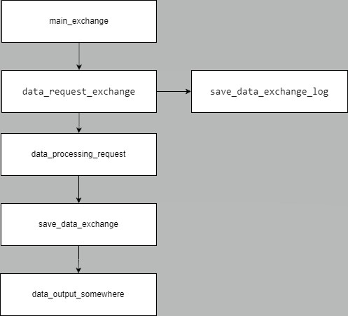

# Project

## Команда

### Состав

* Роман И.Б.
* Абдулаев З.И.
* Якупов Р.А.

## Условие задачи

Анализатор курса валют на текущий день. Сервис для получения ежедневных данных курса валют (5-10 самых распростаненненых, с последующим расширением функционала).
Запись логов запросов. Выгрузка данных в разных форматах. Перевод валют.
На перспективу :организация бота, который выдает текущий курс валют (возможно сравнение с предыдущими датами). Организация БД.

***

## Основные блоки

* data_request_exchange
* data_processing_request
* save_data_exchange
* save_data_exchange_log
* data_output_somewhere
* data_viewer_output
* main_exchange

***

## Разработка

|Название блока          |Разработчик|Доп.иформация  |
|-----------------------:|----------:|--------------:|
|data_request_exchange   |Имя        |               |
|data_processing_request |Имя        |               |
|save_data_exchange      |Имя        |               |
|save_data_exchange_log  |Имя        |               |
|data_output_somewhere   |Имя        |               |
|data_viewer_output      |Имя        |               |
|main_exchange           |Имя        |               |
||||

***

## Описание блоков

1. data_request_exchange
    * Метод запроса данных валют с сайта валют. Возможно через запрос api или парсим всю страницу. 
      Если файл или запись с датой запроса существует, то работаем с ним. Если нет то делаем запрос на сайт.     
      запрос данных      
      выход - данные    
    * функция переменная содержание
2. data_processing_request
    * Метод обработки полученных данных. (На перспктиву: перевод одной валюты в другую)     
      вход - данные из запроса      
      выход - дата валюта курс      
    * функция переменная содержание
3. save_data_exchange
    * Метод сохранения даты запроса валют, курса в файл.    
      вход - дата валюта курс    
      выход - файл xml,html,json, csv (на перспективу: запись в БД)    
    * функция переменная содержание
4. save_data_exchange_log
    * Метод сохранения лога запроса.      
      вход - дата валюта курс    
      выход - csv файл (в дальнейшем запись в БД)     
    * функция переменная содержание
5. data_output_somewhere
    * Метод представления информации пользователю. (на перспективу: вывод напрямую в телеграм(бот))      
    * функция переменная содержание
6. data_viewer_output
    * Вывод информации пользователю.      
    * функция переменная содержание
7. main_exchange
    * Тело программы    
    * функция переменная содержание    

    ***

## Блок схема

